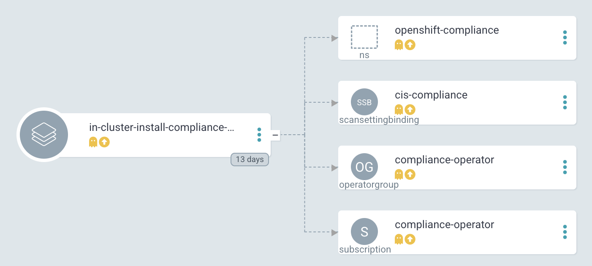
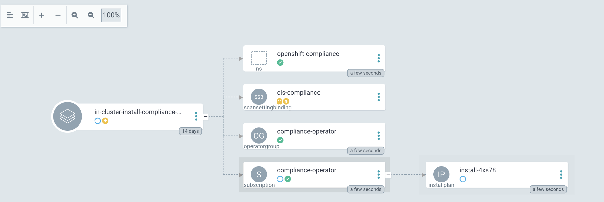
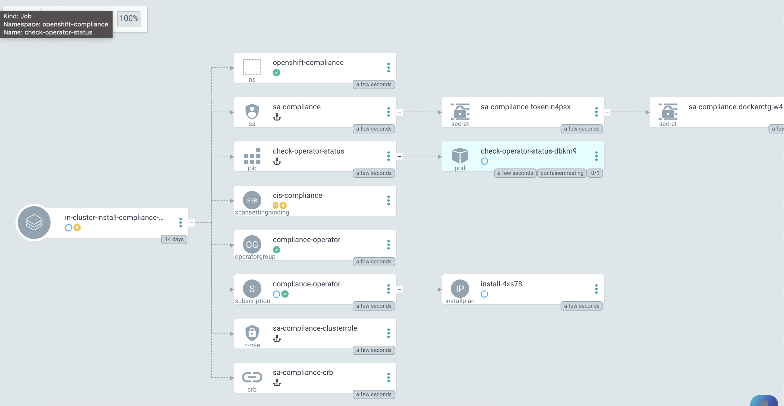
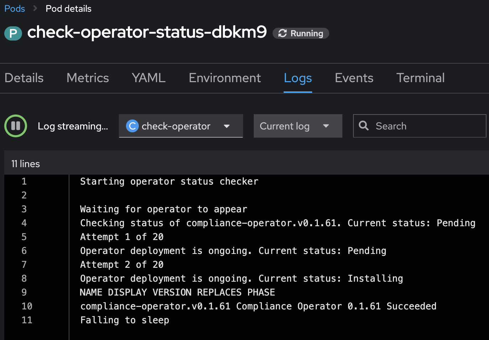
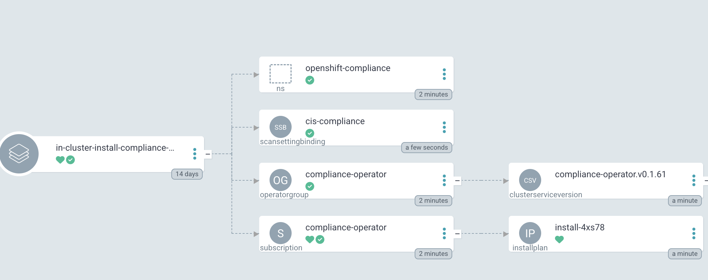

# Operator installation with Argo CD/GitOps

GitOps for application deployment and cluster configuration is an
approach I am trying to achieve for every customer from the very
beginning when starting the Kubernetes journey. For me, as more on the
infrastructure side of things, I am focused on the configuration of
an environment. Meaning, configuring a cluster, installing an operator
etc.

In this article, I would like to share how I deal with cluster
configuration when certain Kubernetes objects are dependent on each
other and how to use Kubernetes but also Argo CD features to resolve
these dependencies.

This article assumes that you have the **openshift-gitops** Operator,
which provides Argo CD, installed, and configured already.

## The Idea

Everything should be seen as a code. Everything should be possible to be
deployed in a repeatable way. With a GitOps approach, everything is
stored naturally in Git and from there, a GitOps agent validates and
synchronizes changes to one or more clusters.

When it comes to OpenShift, Red Hat supports Argo CD using the Operator
**openshift-gitops**. This gives you everything you need to deploy an
Argo CD instance. The only thing you need to take care of is a Git
repository, no matter if it is GitHub, Gitlab, Bitbucket etc.

## The Problem

Sometimes Kubernetes objects depend on each other. This is especially
true when you would like to install and configure Operators, where the
configuration, based on a Customer Resource Definition (CRD), can only
happen after the Operator has been installed and is ready.

Why is that? Well, when you want to deploy an Operator, you will store a
“Subscription object” in Git. Argo CD will take this object and applies
it to the cluster. However, for an Operator, the creation of the
Subscription object is just the first step. A lot of other steps are
required until the Operator gets ready. Unfortunately, Argo CD cannot easily
verify if the installation is successful. All it sees is that the
Subscription object has been created and then it immediately tries to
deploy the CRD. The CRD is not yet available on the system because
the Operator is still installing it.

Even if you use Argo CD features like Syncwaves it would not wait until the
Operator is successfully installed because for Argo CD the “success” is
the creation of the Subscription object. Custom Health checks inside Argo CD did also not help.

Subsequently, the Argo CD synchronization process will fail. You could
now try to automatically “Retry” the sync or use multiple Argo CD
applications that you execute one after the other. Still I was not fully
happy with that and tried a different approach.

## My Solution

There are different options to solve the problem. I am using a Kubernetes Job that performs some commands to verify the status of the Operator. Let’s say I would like to deploy and configure the **Compliance
Operator**. The steps would be:

1.  Install the Operator.
2.  Wait until the Operator is ready.
3.  Configure Operator specific CRDs (for example ScanSettingBinding).

This *Wait until the Operator is ready* is the tricky party for Argo CD.
What I have done is the following:

1.  Install the Operator, this is the first step and is done during **Sync
    Wave 0**.

2.  Create a Kubernetes **Job** that verifies the status of the Operator.
    This Job additionally requires a ServiceAccount and a role with a
    binding. They are configured during Sync Wave 1. 
    
    Moreover, I use a **Hook** (another Argo CD feature) with the deletion policy **HookSucceeded**.
    This makes sure that the Job, ServiceAccount, Role and RoleBinding
    are removed after the status has been verified. The verification is
    successful as soon as the Operator status says “Succeeded”. All the Job does is to execute some oc commands. For example,

```yaml
        oc get clusterserviceversion openshift-gitops-operator.v1.8.0 -n openshift-gitops -o jsonpath={.status.phase}

        Succeeded
```

3.  Finally, during the next Sync Wave (2+) the CRD can be deployed. In
    this case, I deploy the object **ScanSettingBinding**.

In Argo CD everything is correctly synchronized, and the Operator and
its configuration is in place.

This approach helps me to install and
configure any Operator in one Argo CD Application. While it is not 100% the GitOps way, the Job that is executed is repeatable. 

More information about Sync Waves and Hooks can be found in the official
Argo CD documentation: [Sync Phases and
Waves](https://argo-cd.readthedocs.io/en/stable/user-guide/sync-waves/)

## Let’s see this in Action

**Prerequisites**

1.  OpenShift cluster 4.x
2.  openshift-gitops is installed and ready to be used.
3.  Access to GitHub (or to your own Repository)

As an example, repository for Helm charts, I am using <https://charts.stderr.at/>
and from there the following charts:

1.  **compliance-operator-full-stack**
    1.  **helper-operator** (sub chart): Responsible to install the
        Operators.

    2.  **helper-status-checker** (sub chart): Responsible to check the
        status of the Operator (any maybe approve the InstallPlan if required).

### Argo CD Application

In Argo CD I have the following Application configured:

```yaml showLineNumbers
    apiVersion: argoproj.io/v1alpha1
    kind: Application
    metadata:
      name: in-cluster-install-compliance-scans
      namespace: openshift-gitops
    spec:
      destination:
        namespace: default
        server: 'https://kubernetes.default.svc' <1>
      info:
        - name: Description
          value: Deploy and configure the Compliance Scan Operator
      project: in-cluster
      source:
        path: charts/compliance-operator-full-stack <2>
        repoURL: 'https://github.com/tjungbauer/helm-charts'
        targetRevision: main
```

1.  Installing on the local cluster where Argo CD is installed.
2.  Git configuration, including path and revision.

The Application would synchronize the objects:

1.  Subscription

2.  OperatorGroup

3.  Namespace (openshift-compliance)

4.  ScanSettingBinding (CRD)



**Where are the objects we need for the Job?** Since they are only
available during the Sync-Hook they will not show up here. In fact, they
will only show up during the time they are alive and will disappear
again after the status of the operator has been verified.

### Helm Chart Configuration

The [Helm
Chart](https://github.com/tjungbauer/helm-charts/tree/main/charts/compliance-operator-full-stack)
gets its configuration from a values file. You can verify the whole file
on GitHub.

The important pieces here are that some variables are handed over to the
appropriate Sub Charts.

#### Operator Configuration

This part is handed over to the Chart “**helper-operator**”.

```yaml
    helper-operator:
      operators:
        compliance-operator:
          enabled: true
          syncwave: '0'
          namespace:
            name: openshift-compliance
            create: true
          subscription:
            channel: release-0.1
            approval: Automatic
            operatorName: compliance-operator
            source: redhat-operators
            sourceNamespace: openshift-marketplace
          operatorgroup:
            create: true
            notownnamespace: true
```

It is executed during Sync Wave 0 and defines if a Namespace
(openshift-compliance) shall be created (true) and the specification of
the Operator which you need to know upfront:

1.  **channel**: Defines which channel shall be used. Some operators
    offer different channels.
2.  **approval**: Either Automatic or Manual … defines if the Operator
    shall be updated automatically or requires approval.
3.  **operatorName**: the actual name of the Operator
    (compliance-operator)
4.  **source**: Where does this Operator come from (redhat-operator)
5.  **sourceNamespace**: In this case openshift-marketplace

You can fetch these values by looking at the Packagemanifest:

```bash
    oc get packagemanifest compliance-operator -o yaml
```

#### Status Checker Configuration

This part is handed over to the Sub-Chart "**helper-status-checker**"".
The main values here are the operatorName and the namespace where the
Operator is installed.

What is not visible here is the Sync Wave, which is per default set to 1
inside the Helm Chart. If you need to overwrite it, it can be configured
in this section as well.

```yaml
    helper-status-checker:
      enabled: true <1>
      approver: false  <2>

      # use the value of the currentCSV (packagemanifest) but WITHOUT the version !!
      operatorName: compliance-operator <3>

      # where operator is installed
      namespace:
        name: openshift-compliance <4>

      serviceAccount: <5>
        create: true
        name: "sa-compliance" 
```
1.   Is the status checker enabled or not?
2.   Enable/Disable automatic InstallPlan approver
3.   The name of the operator as it is reported by the value currentCSV inside the packageManifest
4.   The namespace where the Operator has been installed.
5.   The name of the ServiceAccount that is created temporarily.

The operatorName is sometimes different than the Operator name required
for the helper-operator chart. Here it seems the value of the currentCSV
must be used but without the version number. (The Job will look up the
version itself)

#### Operator CRD configuration

The final section of the values file manages the configuration for the
Operator itself. This section does not use a Sub Chart. Instead, the
variables are used in the Main-Chart. In this example, the
**ScanSettingBinding** will be configured during Sync Wave 3, which is
all we need for basic functionality.

```yaml
    compliance:
      scansettingbinding:
        enabled: true
        syncwave: '3' <1>
        profiles: <2>
          - name: ocp4-cis-node
          - name: ocp4-cis
        scansetting: default
```
1.   Define the Sync Wave. This value must be higher than the Sync Wave
    of the **helper-status-checker**
2.   ScanSettingBinding configuration. Two profiles are used in this
    example.

A full example of the values-file can be found at: https://github.com/tjungbauer/helm-charts/blob/main/charts/compliance-operator-full-stack/values.yaml 

### Synchronizing Argo CD

1.  Basic Application in Argo CD before it is synced:

    

2.  Sync Wave 0: Synchronization has started. Namespace and Subscription
    are deployed.

    

3.  Sync Wave 1: Status Checker Job has started and tries to verify the
    Operator.

    


4.  The Log output of the Operator. You can see that the status switches
    from Pending to Installing to Succeeded.

    

5.  After Sync Wave 3, the whole Application has been synchronized and
    the Checker Job has been removed.

    

## Conclusio

This is one way to install and configure an Operator using one single Argo CD application. It is working on different installations and for different setups. Other options might still be feasible to you, like using retries or multiple Applications. I prefer this solution though, since I only must manage a single App.
